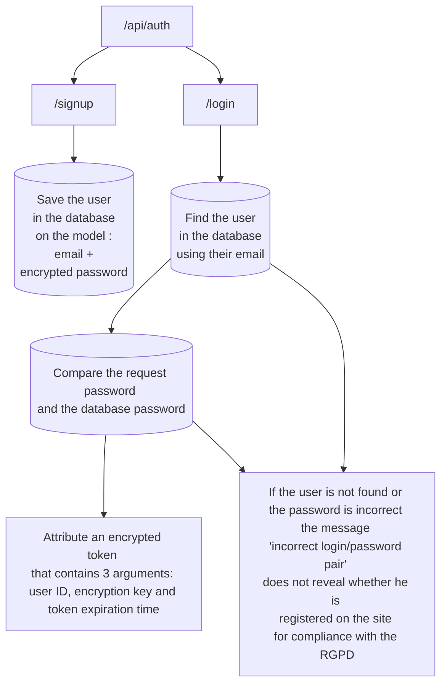
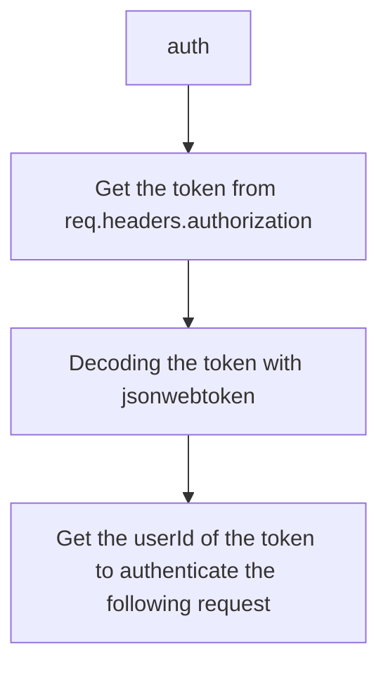
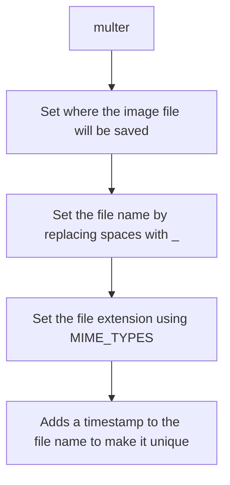
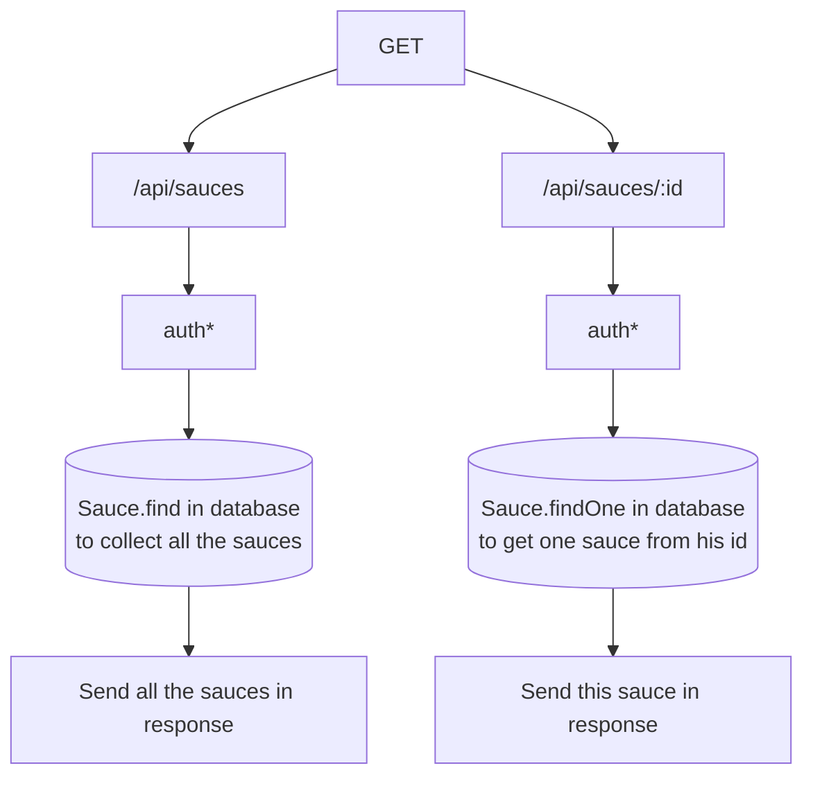
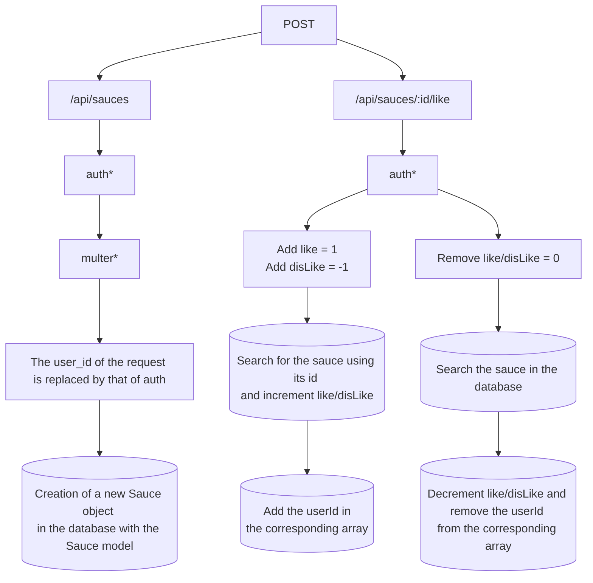
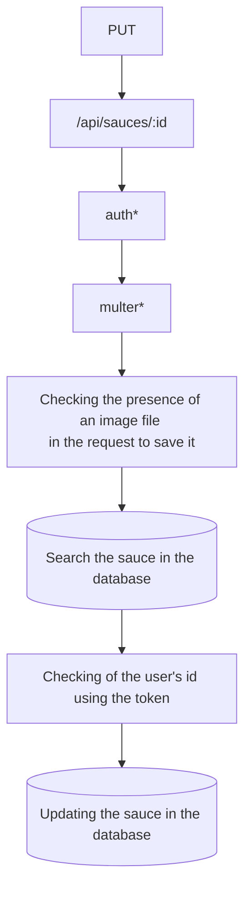
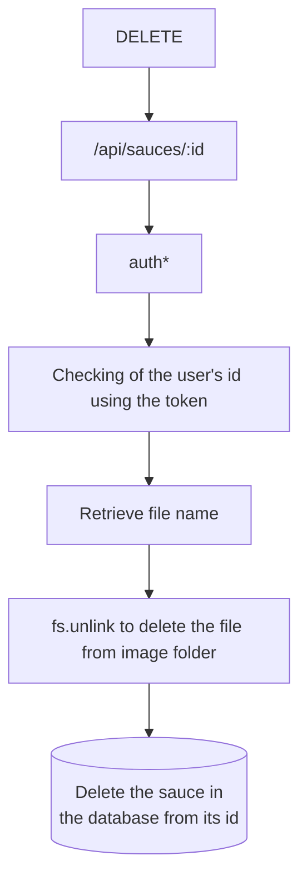

# Piiquante

This is the code of the API of the site **Piiquante** for the project 6 of the web developer training **OpenClassroom**.
Piiquante is dedicated to creating spicy sauces whose recipes are kept secret. To capitalize on its success and generate more buzz, the company wants to create a web application in which users can add their favorite sauces and like or dislike sauces added by others.


# To start


## Prerequisites

Front-end - [Use the project repository for the frontend and follow its README](https://github.com/OpenClassrooms-Student-Center/Web-Developer-P6)

For simplicity :
1. Install the latest version of [node.js(LTS)](https://nodejs.org/en/),
2. Install Angular ```$ npm install -g @angular/cli```
3. Clone repository ```https://github.com/OpenClassrooms-Student-Center/Web-Developer-P6.git```
4. Install node packages ```$ npm install```
5. Start the server ```npm start```
6. Open in browser ```http://localhost:4200/```

## Installing the API and Startup

1. Clone API repository ```https://github.com/Krock13/Piiquante.git```
2. Install node packages ```$ npm install```
3. Paste the ```.env``` file provided to you in the root (API)
4. Start the server ```npm start```

!  Warning ! At this stage you have launched the front server and the API server.

# Diagram for API user authentication

As part of the "OpenClassroom" project :

* This diagram discloses the way in which a user authenticates on the site :


* Here is what ```auth``` corresponds to in the following schema :

* Here is what ```multer``` corresponds to in the following schema :

* Schema for GET requests :

* Schema for POST requests :

* Schema for PUT requests :

* Schema for DELETE requests :

