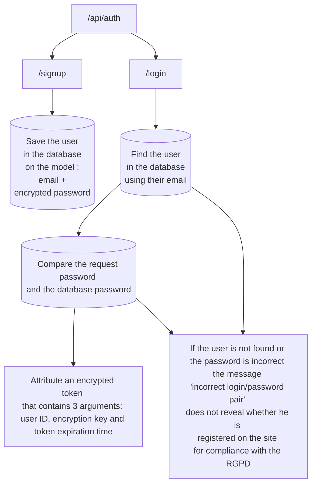

# Piiquante

This is the code of the API of the site **Piiquante** for the project 6 of the web developer training **OpenClassroom**.
Piiquante is dedicated to creating spicy sauces whose recipes are kept secret. To capitalize on its success and generate more buzz, the company wants to create a web application in which users can add their favorite sauces and like or dislike sauces added by others.


# To start


## Prerequisites

* Front-end - [Use the project repository for the frontend and follow its README](https://github.com/OpenClassrooms-Student-Center/Web-Developer-P6)
* [Node.js](https://nodejs.org/en/)

## Installation

For the API to work, you need to install the following modules:
* Install express ```$ npm install express```
* Install mongoose ```$ npm install mongoose```
* Install bcrypt ```$ npm install bcrypt```
* Install jsonwebtoken ``` $ npm install jsonwebtoken```
* Install multer ```$ npm install multer```
* Install cross-env ```$ npm install cross-env```
* Install dotenv ```$ npm install dotenv --save```

## Startup

From the terminal enter the following command:
```$ npm start```

Then open the browser on the page:
```http://localhost:4200/```

# Diagram for API user authentication

As part of the "OpenClassroom" project, this diagram discloses the way in which a user authenticates on the site.:


